# Image Quilting for Texture Synthesis and Transfer

> This project implements a texture synthesis and transfer technique as described in the paper - [Image Quilting for Texture Synthesis and Transfer](https://people.eecs.berkeley.edu/~efros/research/quilting/quilting.pdf) by Alexei A. Efros and Willian T. Freeman

You may want to check out the [presentation.pdf](/docs/presentation.pdf) file for more details on this project. It was made as the final project for CS 663 - **Digital Image Processing** course in Autumn 2018 at Indian Institute of Technology (IIT) Bombay, India.

## Getting Started

Follow the instructions below to get our project running on your local machine.

1. Run `/src/synthesis.m` file for texture synthesis and `/src/transfer.m` file for texture transfer.
2. Replace the first line/lines with respective input image paths to generate the output images.

## Results

### Synthesis

| Input Texture                              | Output (Quilted Texture)                    | Input Texture                              | Output (Quilted Texture)                    |
| ------------------------------------------ | ------------------------------------------- | ------------------------------------------ | ------------------------------------------- |
| 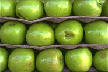 | 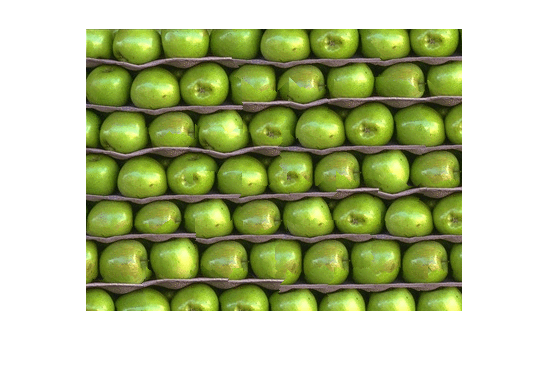 | 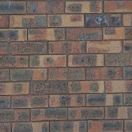 | 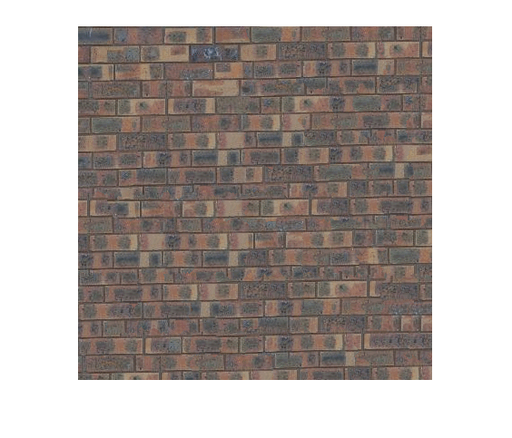 |
| 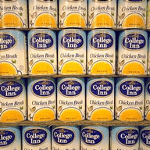 |  | 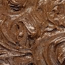 | 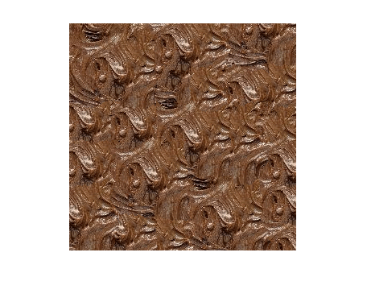 |
| 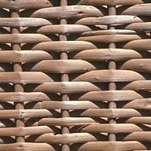 | 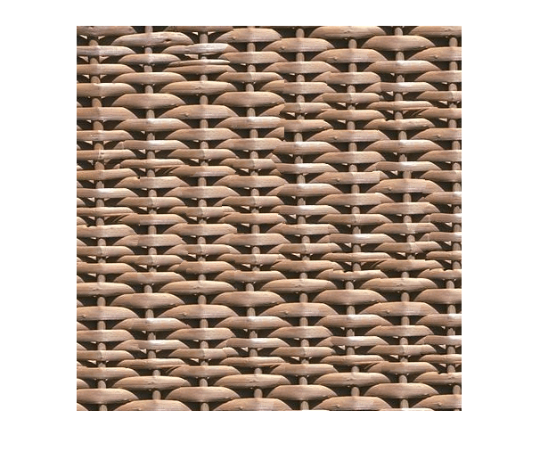 | 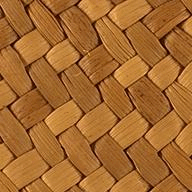 | 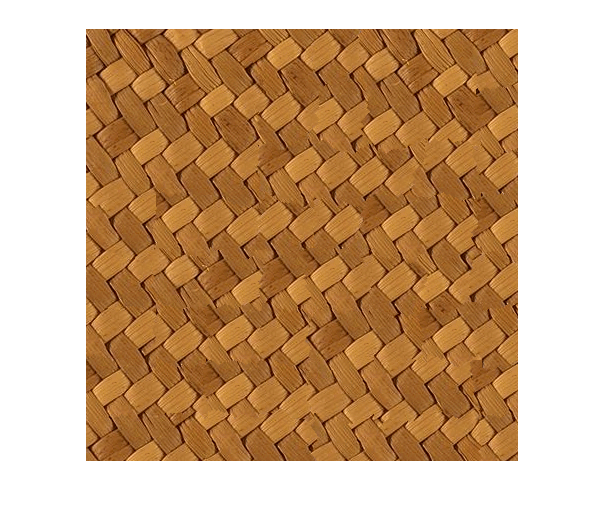 |
| 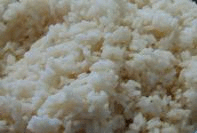 | 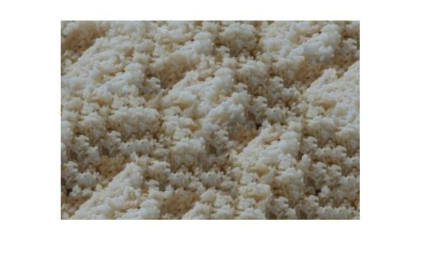 | 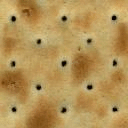 | 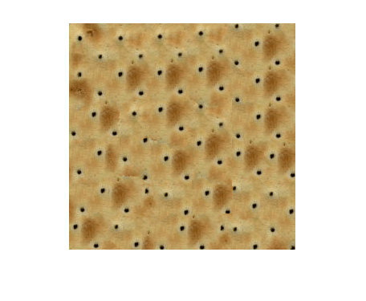 |
| 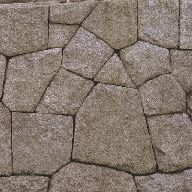 | 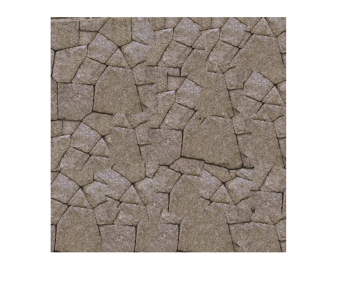 | 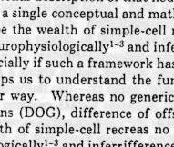 | 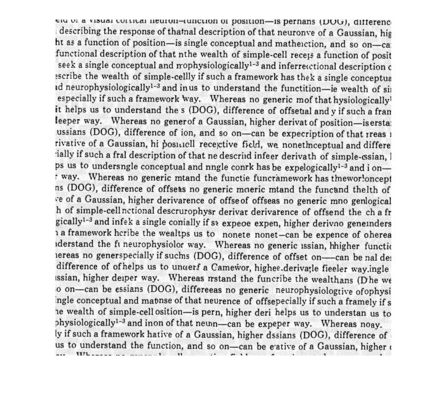 |
| 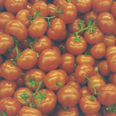 | 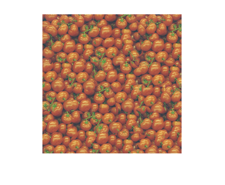 |  | 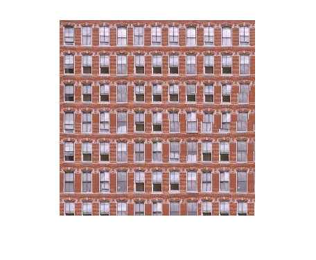 |

### Transfer

| Input Texture | Input Image | Output |
| ---------------------------------------------------- | -------------------------------------------------- | -------------------------------------------------------- |
| 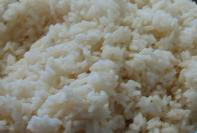                                                    |                                                   | 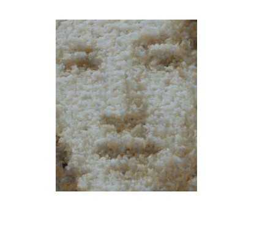                                                        |
| 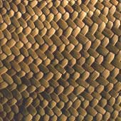                                                    |                                                   | 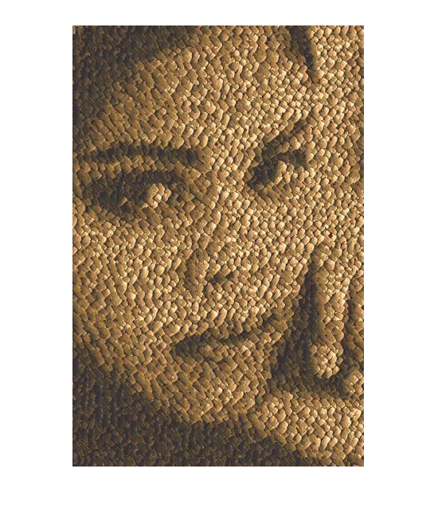                                                        |
| 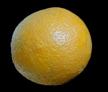                                                    | 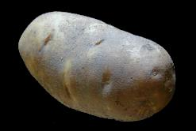                                                  | 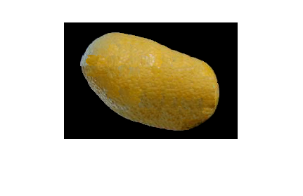                                                        |

## Authors

* **Vamsi Krishna Reddy Satti** - [vamsi3](https://github.com/vamsi3)
* Vighnesh Reddy Konda - [scopegeneral](https://github.com/scopegeneral)
* Suraj Soni

## Acknowledgements

- **[Prof. Alexei A. Efros](https://people.eecs.berkeley.edu/~efros/)** for the amazing database of test images found [here](https://people.eecs.berkeley.edu/~efros/research/quilting/figs/).

## License

This project is licensed under the MIT License - see the [LICENSE](LICENSE) file for details.

